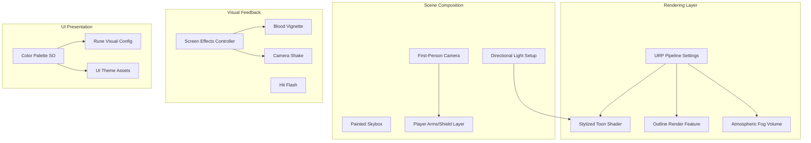

# SHIELD WALL - Visual Style System

**Version:** 0.1  
**Last Updated:** December 2024  
**Companion Document to:** [GameDesignDocument.md](GameDesignDocument.md)  
**Focus:** Visual Implementation & Art Direction

---

## Table of Contents

1. [Overview](#1-overview)
2. [Architecture](#2-architecture)
3. [Color Palette](#3-color-palette)
4. [Implementation Phases](#4-implementation-phases)
5. [Asset Folder Structure](#5-asset-folder-structure)
6. [Shader Specifications](#6-shader-specifications)
7. [Dismemberment System](#7-dismemberment-system)
8. [Validation Checklist](#8-validation-checklist)
9. [Appendix A: Asset Shopping List](#appendix-a-asset-shopping-list)
10. [Appendix B: Quick Reference](#appendix-b-quick-reference)

---

## 1. Overview

### Aesthetic Pillars

The visual style combines multiple references into a cohesive identity:

| Reference | What to Take | Application |
|-----------|--------------|-------------|
| **Darkest Dungeon** | Oppressive mood, stark lighting, psychological dread | Atmosphere, lighting, vignette |
| **Banner Saga** | Painted textures, Viking character design, rotoscope-inspired animation | Character art, UI design |
| **Kingdom Come: Deliverance** | Gritty realism, mud and iron, weight and impact | Material quality, environmental grounding |

### Core Visual Pillars

1. **Stylized but Gritty** - Painted textures with blood and mud, not clean or cartoony
2. **Dismemberment as Reward** - Kills feel brutal and earned; violence is the payoff
3. **Atmospheric Oppression** - Fog, overcast skies, claustrophobic framing
4. **First-Person Intimacy** - See the carnage up close; blood on your shield

### Why Stylized?

As noted in GDD Section 8:
- More forgiving of solo dev art skills
- Faster to produce than realistic
- Ages better over time
- Creates strong visual identity

### Target Aesthetic

Imagine standing in a muddy field under gray skies. Your shield is battered wood and iron. Your brothers beside you are bloodied but standing. Ahead, enemies emerge from the fog. When you kill one, you see the axe bite, the blood spray, the limb fall. This is not a clean game. This is Viking survival.

---

## 2. Architecture

### System Relationships



### Layer Configuration

| Layer | Name | Purpose |
|-------|------|---------|
| 6 | PlayerView | Player arms and shield (renders on top) |
| 7 | Brothers | Shield brother characters |
| 8 | Enemies | Enemy characters |

### Camera Setup

| Property | Value | Reason |
|----------|-------|--------|
| FOV | 70-75 | Slightly wide for claustrophobic feel |
| Near Clip | 0.1 | Close weapon rendering |
| Clear Flags | Skybox | Atmospheric background |
| Position | (0, 1.7, 0) | Eye height |

---

## 3. Color Palette

### Primary Colors (Earth Tones)

| Name | Hex | RGB | Usage |
|------|-----|-----|-------|
| Mud Brown | `#4A3728` | (74, 55, 40) | Ground, dirt, leather base |
| Worn Leather | `#6B4E3D` | (107, 78, 61) | Armor, straps, UI panels |
| Iron Gray | `#5C5C5C` | (92, 92, 92) | Metal, shields, weapons |
| Bone White | `#D4C8B8` | (212, 200, 184) | Text, highlights, skulls |

### Accent Colors (Combat)

| Name | Hex | RGB | Usage |
|------|-----|-----|-------|
| Blood Red | `#8B2020` | (139, 32, 32) | Health, damage, blood |
| Fire Orange | `#C45C26` | (196, 92, 38) | Fire, aggression, warnings |
| Iron Blue | `#3D5A6E` | (61, 90, 110) | Stamina, cold, defense |
| Gold Highlight | `#C9A227` | (201, 162, 39) | Glory, kills, success |

### Rune Colors

| Rune | Symbol | Name | Primary Color | Hex |
|------|--------|------|---------------|-----|
| ᚦ | Shield | THURS | Iron Gray | `#5C5C5C` |
| ᛏ | Axe | TYR | Blood Red | `#8B2020` |
| ᚷ | Spear | GEBO | Bronze | `#8B6914` |
| ᛒ | Tree | BERKANA | Forest Green | `#3D5C3D` |
| ᛟ | Eye | OTHALA (Odin) | Gold | `#C9A227` |
| ᛚ | Wave | LAGUZ (Loki) | Purple | `#5C3D6E` |

### UI Theme Colors

| Element | Color | Hex |
|---------|-------|-----|
| Background | Dark Brown | `#2A1F1A` |
| Panel | Leather (80% alpha) | `#6B4E3D` |
| Text Primary | Bone White | `#D4C8B8` |
| Text Secondary | Muted Tan | `#A89880` |
| Accent | Gold | `#C9A227` |
| Health | Blood Red | `#8B2020` |
| Stamina | Iron Blue | `#3D5A6E` |

---

## 4. Implementation Phases

### Phase 1: Foundation - Color & Data (Week 1)

| Step | Task | Output |
|------|------|--------|
| 1.1 | Create VisualConfigSO and RuneVisualSO ScriptableObjects | `Scripts/Data/VisualConfigSO.cs`, `RuneVisualSO.cs` |
| 1.2 | Define color palette constants, create config assets | `ScriptableObjects/Config/VisualConfig.asset` |
| 1.3 | Create Art folder structure | `Assets/Art/` hierarchy |

### Phase 2: Toon Shader System (Week 2)

| Step | Task | Output |
|------|------|--------|
| 2.1 | Research URP Shader Graph setup | Decision: Shader Graph for solo dev speed |
| 2.2 | Create base toon shader (3-band lighting, rim light) | `Art/Shaders/ShieldWall_Toon.shadergraph` |
| 2.3 | Create toon material instances | `M_Character_Player.mat`, `M_Character_Brother.mat`, `M_Character_Enemy.mat` |
| 2.4 | Add outline render feature | `Art/Shaders/OutlineRenderFeature.cs` |

### Phase 3: Scene Composition (Week 3)

| Step | Task | Output |
|------|------|--------|
| 3.1 | Create Battle scene with camera and lighting | `Scenes/Battle.unity` |
| 3.2 | Configure atmospheric Volume (fog, color grading, vignette) | Volume Profile settings |
| 3.3 | Create gradient skybox material | `Art/Materials/Skybox_Battle.mat` |
| 3.4 | Set up PlayerView layer and dual-camera system | Layer configuration |
| 3.5 | Create player shield placeholder | First-person shield prefab |

### Phase 4: Visual Feedback System (Week 4)

| Step | Task | Output |
|------|------|--------|
| 4.1 | Create ScreenEffectsController | `Scripts/UI/ScreenEffectsController.cs` |
| 4.2 | Implement damage vignette pulse | Red vignette on player damage |
| 4.3 | Implement camera shake with presets | Light/Medium/Heavy shake |
| 4.4 | Implement hit flash overlay | White/Red/Gold flash colors |

### Phase 5: UI Visual Theme (Week 5)

| Step | Task | Output |
|------|------|--------|
| 5.1 | Create UIThemeSO | `Scripts/Data/UIThemeSO.cs` |
| 5.2 | Set up rune font, create RuneVisualSO assets | Nordic rune font, per-rune config |
| 5.3 | Create DieVisual prefab | `Prefabs/UI/DieVisual.prefab` |
| 5.4 | Create HealthHeart prefab | `Prefabs/UI/HealthHeart.prefab` |

### Phase 6: Character Placeholders (Week 6)

| Step | Task | Output |
|------|------|--------|
| 6.1 | Create Brother placeholder prefab | `Prefabs/Characters/Brother_Placeholder.prefab` |
| 6.2 | Create Enemy placeholder prefab | `Prefabs/Characters/Enemy_Placeholder.prefab` |
| 6.3 | Create FormationPositions system | `Scripts/ShieldWall/FormationPositions.cs` |

### Phase 7: Dismemberment System (Week 7-8)

See [Section 7: Dismemberment System](#7-dismemberment-system) for full details.

---

## 5. Asset Folder Structure

```
Assets/
├── Art/
│   ├── Shaders/
│   │   ├── ShieldWall_Toon.shadergraph
│   │   ├── OutlineRenderFeature.cs
│   │   └── Outline.shader
│   ├── Materials/
│   │   ├── Characters/
│   │   │   ├── M_Character_Player.mat
│   │   │   ├── M_Character_Brother.mat
│   │   │   └── M_Character_Enemy.mat
│   │   ├── Environment/
│   │   │   ├── M_Environment_Ground.mat
│   │   │   └── Skybox_Battle.mat
│   │   └── UI/
│   ├── Textures/
│   │   ├── Characters/
│   │   ├── Environment/
│   │   └── Effects/
│   │       ├── BloodSplatter_01.png
│   │       ├── BloodSplatter_02.png
│   │       ├── BloodSplatter_03.png
│   │       ├── ScreenBlood_01.png
│   │       └── ScreenBlood_02.png
│   ├── Models/
│   │   ├── Characters/
│   │   └── Environment/
│   └── VFX/
│       ├── Prefabs/
│       │   ├── BloodBurst.prefab
│       │   └── BloodDecal.prefab
│       └── Textures/
├── Prefabs/
│   ├── UI/
│   │   ├── DieVisual.prefab
│   │   └── HealthHeart.prefab
│   ├── Characters/
│   │   ├── Brother_Placeholder.prefab
│   │   └── Enemy_Placeholder.prefab
│   └── Gore/
│       ├── SeveredHead.prefab
│       ├── SeveredArm.prefab
│       └── SeveredLeg.prefab
└── Audio/
    └── SFX/
        └── Gore/
            ├── flesh_slice.wav
            ├── bone_crack.wav
            ├── blood_splat.wav
            └── wet_thud.wav
```

---

## 6. Shader Specifications

### Toon Shader Features

| Feature | Description | Priority |
|---------|-------------|----------|
| 3-Band Diffuse | Stepped lighting (shadow, mid, highlight) | MUST |
| Soft Shadow Edges | Not harsh cel-shading, more painterly | MUST |
| Rim Lighting | Silhouette enhancement | SHOULD |
| Desaturation Control | Per-material desaturation slider | SHOULD |
| Painterly Overlay | Optional texture overlay for painted look | NICE |

### Lighting Configuration

| Property | Value | Notes |
|----------|-------|-------|
| Shadow Threshold 1 | 0.3 | Shadow to mid transition |
| Shadow Threshold 2 | 0.7 | Mid to highlight transition |
| Shadow Color | Desaturated base × 0.5 | Keep shadows cool |
| Rim Power | 3.0 | Edge detection sharpness |
| Rim Intensity | 0.3 | Subtle, not glowing |

### Outline Render Feature

| Property | Value |
|----------|-------|
| Outline Color | `#2A1F1A` (dark brown) |
| Outline Width | 1-2 pixels |
| Detection Method | Depth + Normal threshold |
| Depth Threshold | 0.1 |
| Normal Threshold | 0.4 |

---

## 7. Dismemberment System

### Design Philosophy

Dismemberment is a **core visual pillar**, not polish. Every enemy kill should feel brutal and earned. The violence is the reward for successful combat.

### Architecture Approach

**Mesh Swapping** (Recommended for solo dev):

```
Enemy Prefab/
├── Visuals/
│   ├── Intact (default, active)
│   ├── Headless (inactive)
│   ├── ArmlessSword (inactive)
│   └── Legless (inactive, future)
├── Hitbox
└── EnemyController
```

On kill:
1. Disable "Intact" child mesh
2. Enable appropriate dismembered variant
3. Spawn loose limb prefab at correct position
4. Play blood burst VFX
5. Spawn blood decals
6. Play gore audio

### Severable Limb Types

| Limb | Kill Trigger | Visual Impact | Priority |
|------|--------------|---------------|----------|
| Head | Decapitation kill | HIGHEST | MUST |
| Sword Arm | Counter-attack kill | HIGH | MUST |
| Shield Arm | Shield bash kill | MEDIUM | SHOULD |
| Leg | Spear thrust kill | MEDIUM | SHOULD |

**Prototype scope:** Head + Sword Arm only

### Kill-to-Dismemberment Mapping

| Action | Combo | Dismemberment |
|--------|-------|---------------|
| Strike | ᛏᚷ (Axe+Spear) | Random: head or arm |
| Counter | ᛏᚦ (Axe+Shield) | Head (decapitation) |
| Berserker | ᛏᛏᛏ (3× Axe) | All visible limbs (massacre) |
| Spear Wall | ᚷᚷᚷ (3× Spear) | Torso (impalement, no limb) |

### Loose Limb Prefab Components

Each severed limb prefab contains:

| Component | Purpose |
|-----------|---------|
| Mesh Filter | Visual geometry |
| Mesh Renderer | Toon material |
| Rigidbody | Physics tumble |
| Collider | Ground collision |
| Blood Trail Emitter | Trailing blood particles |
| Auto-Destroy Script | Remove after 10 seconds |

### Blood Burst VFX Settings

| Property | Value |
|----------|-------|
| Emission | Burst: 50-100 particles |
| Shape | Cone toward camera |
| Color Start | Deep red `#6B1010` |
| Color End | Dark `#2A0505` |
| Size | Random 0.05-0.2 |
| Lifetime | 0.5-1.5 seconds |
| Gravity | Yes |
| Collision | Optional (blood on ground) |

### Blood Decal Settings

| Property | Value |
|----------|-------|
| Type | URP Decal Projector |
| Textures | 3 splatter variants (512×512) |
| Rotation | Random |
| Scale | Random 0.5-2.0 |
| Lifetime | 30 seconds OR persist until wave end |

### Screen Blood Overlay

Triggered when player takes damage:

| Property | Value |
|----------|-------|
| Element | UI Image with alpha splatter |
| Position | Random screen location |
| Fade In | Quick (0.1s) |
| Fade Out | Slow (3-5 seconds) |
| Stacking | Multiple splatters can overlap |
| Intensity | Scales with damage amount |

### Gore Sound Effects

| Sound | Trigger | Notes |
|-------|---------|-------|
| Flesh slice | Any dismemberment | Wet cutting sound |
| Bone crack | Limb sever | Sharp snap |
| Blood splat | Blood burst | Wet impact |
| Wet thud | Limb landing | Meat hitting ground |
| Gurgle | Decapitation only | Human gargle |

### Brother Wound Visuals

| Wounds | Visual State |
|--------|--------------|
| 0 | Clean, fresh appearance |
| 1 | Blood on armor, slight stance change |
| 2 | Heavy blood, staggering, missing helmet |
| 3 | Death (with dismemberment) |

---

## 8. Validation Checklist

Before moving to gameplay implementation, verify:

### Rendering
- [ ] Toon shader renders with 3-band lighting
- [ ] Outlines visible on characters
- [ ] Materials have correct base colors

### Scene
- [ ] Scene has atmospheric fog and overcast mood
- [ ] Skybox matches aesthetic
- [ ] Directional light creates proper shadows

### First-Person View
- [ ] Player shield visible at screen bottom
- [ ] Brothers visible at screen edges
- [ ] Enemies visible ahead
- [ ] Layer separation works (PlayerView on top)

### Visual Feedback
- [ ] Damage vignette effect triggers correctly
- [ ] Camera shake works with all presets
- [ ] Hit flash shows correct colors

### UI
- [ ] Dice display runes with correct colors
- [ ] Health hearts show filled/empty states
- [ ] UI theme colors match palette

### Dismemberment (Critical)
- [ ] Dismemberment triggers on enemy kill
- [ ] Loose limbs spawn with physics
- [ ] Blood burst VFX plays on kill
- [ ] Blood decals appear on ground
- [ ] Screen blood overlay on player damage
- [ ] Gore sounds play on dismemberment

### Overall
- [ ] Aesthetic matches Darkest Dungeon + Banner Saga + visceral gore
- [ ] Performance acceptable on target hardware
- [ ] No visual bugs or artifacts

---

## Appendix A: Asset Shopping List

### Must Acquire

| Asset | Source | Priority | Est. Cost |
|-------|--------|----------|-----------|
| Nordic rune font | Google Fonts / FontSquirrel | HIGH | Free |
| Heart icon sprite | Create or Asset Store | HIGH | Free |
| Blood splatter textures | Create or AI generate | HIGH | Free |
| Screen blood overlays | Create or AI generate | HIGH | Free |

### Should Acquire

| Asset | Source | Priority | Est. Cost |
|-------|--------|----------|-----------|
| Shield texture | Create or AI generate | MEDIUM | Free |
| Ground texture (mud) | Asset Store | MEDIUM | Free-$10 |
| Gore sound effects | Sonniss / Freesound | MEDIUM | Free |

### Nice to Have (Polish Phase)

| Asset | Source | Priority | Est. Cost |
|-------|--------|----------|-----------|
| Low-poly Viking models | Synty / Polygon | LOW | $20-30 |
| Painted texture pack | Asset Store | LOW | $15-25 |
| War drum music | Commission / Royalty-free | LOW | $50-150 |

### Total Estimated Budget

| Phase | Cost |
|-------|------|
| Prototype (free assets only) | $0 |
| Vertical Slice | $20-50 |
| Polish | $100-200 |

---

## Appendix B: Quick Reference

### Color Codes (Copy-Paste)

```csharp
// Primary Colors
public static Color MudBrown = new Color(0.29f, 0.22f, 0.16f);      // #4A3728
public static Color WornLeather = new Color(0.42f, 0.31f, 0.24f);   // #6B4E3D
public static Color IronGray = new Color(0.36f, 0.36f, 0.36f);      // #5C5C5C
public static Color BoneWhite = new Color(0.83f, 0.78f, 0.72f);     // #D4C8B8

// Accent Colors
public static Color BloodRed = new Color(0.55f, 0.13f, 0.13f);      // #8B2020
public static Color FireOrange = new Color(0.77f, 0.36f, 0.15f);    // #C45C26
public static Color IronBlue = new Color(0.24f, 0.35f, 0.43f);      // #3D5A6E
public static Color GoldHighlight = new Color(0.79f, 0.64f, 0.15f); // #C9A227

// Rune Colors
public static Color ThursColor = IronGray;                           // #5C5C5C
public static Color TyrColor = BloodRed;                             // #8B2020
public static Color GeboColor = new Color(0.55f, 0.41f, 0.08f);     // #8B6914
public static Color BerkanaColor = new Color(0.24f, 0.36f, 0.24f);  // #3D5C3D
public static Color OthalaColor = GoldHighlight;                     // #C9A227
public static Color LaguzColor = new Color(0.36f, 0.24f, 0.43f);    // #5C3D6E
```

### Formation Positions

```csharp
// Brother positions (relative to camera)
Vector3 FarLeft = new Vector3(-2.5f, 0f, 2f);
Vector3 Left = new Vector3(-1.2f, 0f, 1.5f);
Vector3 Right = new Vector3(1.2f, 0f, 1.5f);
Vector3 FarRight = new Vector3(2.5f, 0f, 2f);

// Enemy grid (Z = 4-6, X = -2 to 2)
```

### Camera Shake Presets

```csharp
// Shake presets (intensity, duration)
ShakePreset Light = (0.1f, 0.1f);   // Block
ShakePreset Medium = (0.2f, 0.2f);  // Hit taken
ShakePreset Heavy = (0.4f, 0.3f);   // Brother death
```

### Key Files

| System | Primary File |
|--------|--------------|
| Visual Config | `Scripts/Data/VisualConfigSO.cs` |
| Toon Shader | `Art/Shaders/ShieldWall_Toon.shadergraph` |
| Screen Effects | `Scripts/UI/ScreenEffectsController.cs` |
| Dismemberment | `Scripts/Combat/DismembermentController.cs` |
| Formation | `Scripts/ShieldWall/FormationPositions.cs` |

---

*This document complements the [Game Design Document](GameDesignDocument.md). For gameplay systems, refer to GDD Sections 3-7. For technical architecture, see GDD Section 10.*

**Visual Goal: Make killing feel as brutal as survival is desperate.**


