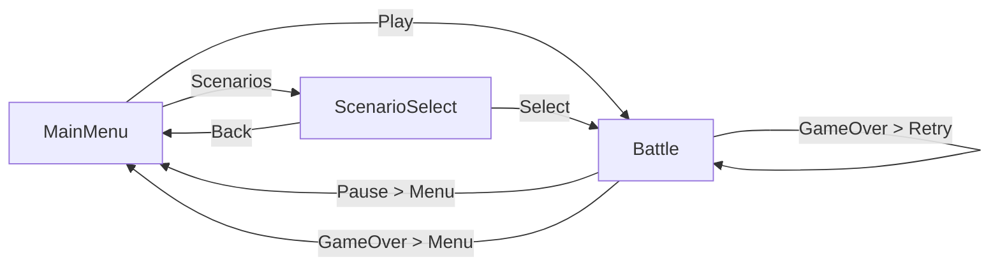

# Phase 3 - Track F: Menus & Scene Flow

## Assignment

You are implementing **Track F** of Phase 3: Content + Polish.

Your focus is creating the main menu, scenario selection, pause menu, and scene navigation.

---

## Your Scope

### Files to CREATE

| File | Purpose |
|------|---------|
| `Assets/Scripts/UI/MainMenuUI.cs` | Main menu screen |
| `Assets/Scripts/UI/ScenarioSelectUI.cs` | Scenario selection screen |
| `Assets/Scripts/UI/ScenarioCardUI.cs` | Individual scenario card |
| `Assets/Scripts/UI/PauseMenuUI.cs` | Pause overlay |
| `Assets/Scripts/Core/SceneLoader.cs` | Scene transition helper |

### Scenes to CREATE

| Scene | Purpose |
|-------|---------|
| `Assets/Scenes/MainMenu.unity` | Title screen |

### Prefabs to CREATE

| Prefab | Purpose |
|--------|---------|
| `Assets/Prefabs/UI/MainMenuCanvas.prefab` | Main menu UI |
| `Assets/Prefabs/UI/ScenarioCard.prefab` | Scenario card template |
| `Assets/Prefabs/UI/PauseMenuCanvas.prefab` | Pause overlay |

---

## DO NOT TOUCH

- `Assets/Scripts/Core/*` (except creating SceneLoader.cs)
- `Assets/Scripts/Combat/*`
- `Assets/Scripts/Dice/*`
- `Assets/Scenes/Battle.unity` (only add PauseMenuCanvas)
- Existing UI files

---

## Implementation Details

### F1: SceneLoader

```csharp
using UnityEngine;
using UnityEngine.SceneManagement;
using System.Collections;

namespace ShieldWall.Core
{
    public class SceneLoader : MonoBehaviour
    {
        public static SceneLoader Instance { get; private set; }
        
        [SerializeField] private CanvasGroup _fadePanel;
        [SerializeField] private float _fadeDuration = 0.5f;
        
        void Awake()
        {
            if (Instance != null && Instance != this)
            {
                Destroy(gameObject);
                return;
            }
            Instance = this;
            DontDestroyOnLoad(gameObject);
        }
        
        public void LoadScene(string sceneName)
        {
            StartCoroutine(LoadSceneWithFade(sceneName));
        }
        
        public void LoadMainMenu() => LoadScene("MainMenu");
        public void LoadBattle() => LoadScene("Battle");
        
        public void ReloadCurrentScene()
        {
            LoadScene(SceneManager.GetActiveScene().name);
        }
        
        private IEnumerator LoadSceneWithFade(string sceneName)
        {
            // Fade out
            if (_fadePanel != null)
            {
                float elapsed = 0f;
                while (elapsed < _fadeDuration)
                {
                    elapsed += Time.unscaledDeltaTime;
                    _fadePanel.alpha = elapsed / _fadeDuration;
                    yield return null;
                }
            }
            
            // Load
            yield return SceneManager.LoadSceneAsync(sceneName);
            
            // Fade in
            if (_fadePanel != null)
            {
                float elapsed = 0f;
                while (elapsed < _fadeDuration)
                {
                    elapsed += Time.unscaledDeltaTime;
                    _fadePanel.alpha = 1f - (elapsed / _fadeDuration);
                    yield return null;
                }
                _fadePanel.alpha = 0f;
            }
        }
        
        public void QuitGame()
        {
            #if UNITY_EDITOR
            UnityEditor.EditorApplication.isPlaying = false;
            #else
            Application.Quit();
            #endif
        }
    }
}
```

### F2: MainMenuUI

```csharp
using UnityEngine;
using UnityEngine.UI;
using ShieldWall.Core;

namespace ShieldWall.UI
{
    public class MainMenuUI : MonoBehaviour
    {
        [Header("Buttons")]
        [SerializeField] private Button _playButton;
        [SerializeField] private Button _scenariosButton;
        [SerializeField] private Button _settingsButton;
        [SerializeField] private Button _quitButton;
        
        [Header("Panels")]
        [SerializeField] private GameObject _mainPanel;
        [SerializeField] private GameObject _scenarioPanel;
        [SerializeField] private GameObject _settingsPanel;
        
        void Start()
        {
            ShowMainPanel();
            
            _playButton.onClick.AddListener(OnPlayClicked);
            _scenariosButton.onClick.AddListener(OnScenariosClicked);
            _settingsButton.onClick.AddListener(OnSettingsClicked);
            _quitButton.onClick.AddListener(OnQuitClicked);
        }
        
        private void OnPlayClicked()
        {
            // Load default scenario
            ScenarioManager.Instance?.LoadDefaultScenario();
            SceneLoader.Instance?.LoadBattle();
        }
        
        private void OnScenariosClicked()
        {
            ShowScenarioPanel();
        }
        
        private void OnSettingsClicked()
        {
            ShowSettingsPanel();
        }
        
        private void OnQuitClicked()
        {
            SceneLoader.Instance?.QuitGame();
        }
        
        public void ShowMainPanel()
        {
            _mainPanel.SetActive(true);
            _scenarioPanel?.SetActive(false);
            _settingsPanel?.SetActive(false);
        }
        
        public void ShowScenarioPanel()
        {
            _mainPanel.SetActive(false);
            _scenarioPanel?.SetActive(true);
            _settingsPanel?.SetActive(false);
        }
        
        public void ShowSettingsPanel()
        {
            _mainPanel.SetActive(false);
            _scenarioPanel?.SetActive(false);
            _settingsPanel?.SetActive(true);
        }
    }
}
```

### F3: ScenarioSelectUI

```csharp
using System.Collections.Generic;
using UnityEngine;
using UnityEngine.UI;
using ShieldWall.Core;
using ShieldWall.Data;

namespace ShieldWall.UI
{
    public class ScenarioSelectUI : MonoBehaviour
    {
        [SerializeField] private List<BattleScenarioSO> _scenarios;
        [SerializeField] private Transform _cardContainer;
        [SerializeField] private ScenarioCardUI _cardPrefab;
        [SerializeField] private Button _backButton;
        [SerializeField] private MainMenuUI _mainMenu;
        
        private List<ScenarioCardUI> _cards = new List<ScenarioCardUI>();
        
        void Start()
        {
            CreateCards();
            _backButton.onClick.AddListener(OnBackClicked);
        }
        
        private void CreateCards()
        {
            foreach (var scenario in _scenarios)
            {
                var card = Instantiate(_cardPrefab, _cardContainer);
                card.Initialize(scenario);
                card.OnSelected += HandleScenarioSelected;
                _cards.Add(card);
            }
        }
        
        private void HandleScenarioSelected(BattleScenarioSO scenario)
        {
            ScenarioManager.Instance?.SelectScenario(scenario);
            SceneLoader.Instance?.LoadBattle();
        }
        
        private void OnBackClicked()
        {
            _mainMenu?.ShowMainPanel();
        }
        
        void OnDestroy()
        {
            foreach (var card in _cards)
                card.OnSelected -= HandleScenarioSelected;
        }
    }
}
```

### F4: ScenarioCardUI

```csharp
using System;
using UnityEngine;
using UnityEngine.UI;
using TMPro;
using ShieldWall.Data;

namespace ShieldWall.UI
{
    public class ScenarioCardUI : MonoBehaviour
    {
        [SerializeField] private TextMeshProUGUI _nameText;
        [SerializeField] private TextMeshProUGUI _descriptionText;
        [SerializeField] private TextMeshProUGUI _difficultyText;
        [SerializeField] private TextMeshProUGUI _waveCountText;
        [SerializeField] private Button _selectButton;
        [SerializeField] private GameObject _lockedOverlay;
        [SerializeField] private Image _difficultyIcon;
        
        [Header("Difficulty Colors")]
        [SerializeField] private Color _easyColor = new Color(0.2f, 0.7f, 0.2f);
        [SerializeField] private Color _normalColor = new Color(0.8f, 0.6f, 0.1f);
        [SerializeField] private Color _hardColor = new Color(0.8f, 0.2f, 0.2f);
        
        private BattleScenarioSO _scenario;
        
        public event Action<BattleScenarioSO> OnSelected;
        
        public void Initialize(BattleScenarioSO scenario)
        {
            _scenario = scenario;
            
            _nameText.text = scenario.scenarioName;
            _descriptionText.text = scenario.description;
            _waveCountText.text = $"{scenario.waves.Count} Waves";
            
            SetupDifficulty(scenario.difficulty);
            SetupLockState(scenario.isUnlocked);
            
            _selectButton.onClick.AddListener(OnSelectClicked);
        }
        
        private void SetupDifficulty(Difficulty difficulty)
        {
            _difficultyText.text = difficulty.ToString();
            
            Color color = difficulty switch
            {
                Difficulty.Easy => _easyColor,
                Difficulty.Normal => _normalColor,
                Difficulty.Hard => _hardColor,
                _ => _normalColor
            };
            
            _difficultyText.color = color;
            if (_difficultyIcon != null)
                _difficultyIcon.color = color;
        }
        
        private void SetupLockState(bool unlocked)
        {
            _selectButton.interactable = unlocked;
            _lockedOverlay?.SetActive(!unlocked);
        }
        
        private void OnSelectClicked()
        {
            OnSelected?.Invoke(_scenario);
        }
    }
}
```

### F5: PauseMenuUI

```csharp
using UnityEngine;
using UnityEngine.UI;
using ShieldWall.Core;

namespace ShieldWall.UI
{
    public class PauseMenuUI : MonoBehaviour
    {
        [SerializeField] private GameObject _pausePanel;
        [SerializeField] private Button _resumeButton;
        [SerializeField] private Button _restartButton;
        [SerializeField] private Button _mainMenuButton;
        
        private bool _isPaused;
        
        void Start()
        {
            _pausePanel.SetActive(false);
            
            _resumeButton.onClick.AddListener(Resume);
            _restartButton.onClick.AddListener(Restart);
            _mainMenuButton.onClick.AddListener(QuitToMenu);
        }
        
        void Update()
        {
            if (Input.GetKeyDown(KeyCode.Escape))
            {
                if (_isPaused)
                    Resume();
                else
                    Pause();
            }
        }
        
        public void Pause()
        {
            _isPaused = true;
            _pausePanel.SetActive(true);
            Time.timeScale = 0f;
        }
        
        public void Resume()
        {
            _isPaused = false;
            _pausePanel.SetActive(false);
            Time.timeScale = 1f;
        }
        
        public void Restart()
        {
            Time.timeScale = 1f;
            SceneLoader.Instance?.ReloadCurrentScene();
        }
        
        public void QuitToMenu()
        {
            Time.timeScale = 1f;
            SceneLoader.Instance?.LoadMainMenu();
        }
    }
}
```

### F6: Main Menu Scene Setup

**MainMenu.unity structure:**
```
MainMenu (Scene)
├── Main Camera
├── EventSystem
├── SceneLoader (DontDestroyOnLoad)
├── ScenarioManager (DontDestroyOnLoad)
├── AudioManager (DontDestroyOnLoad, optional)
└── Canvas (Screen Space - Overlay)
    ├── Background (Image: dark gradient)
    ├── MainPanel
    │   ├── Title ("SHIELD WALL" - large text)
    │   ├── PlayButton
    │   ├── ScenariosButton
    │   ├── SettingsButton
    │   └── QuitButton
    ├── ScenarioPanel (inactive)
    │   ├── Title ("Select Scenario")
    │   ├── CardContainer (Horizontal Layout)
    │   │   └── ScenarioCards...
    │   └── BackButton
    ├── SettingsPanel (inactive) [placeholder]
    └── FadePanel (full screen black, alpha 0)
```

### F7: Visual Style

**Title Text:**
- Font: Bold, Nordic-style (or default bold)
- Size: 72-96pt
- Color: Off-white (#E8E0D0)
- Outline: Dark brown (#2A1A10)

**Buttons:**
- Size: 300x60
- Background: Dark wood brown (#3A2A1A)
- Text: Warm white (#E8E0D0)
- Hover: Lighter background

**Background:**
- Gradient: Dark brown (#1A1008) to black (#0A0808)
- Or solid dark with subtle texture

---

## Scene Flow



---

## Build Settings

Add scenes to Build Settings:
1. MainMenu (index 0)
2. Battle (index 1)

---

## Success Criteria

- [ ] MainMenu scene loads without errors
- [ ] Play button starts Battle with default scenario
- [ ] Scenarios button shows scenario cards
- [ ] Each scenario card displays correct info
- [ ] Locked scenarios show lock overlay
- [ ] Selecting scenario loads Battle
- [ ] ESC pauses game in Battle
- [ ] Resume returns to game
- [ ] Restart reloads scene
- [ ] Quit to Menu returns to MainMenu
- [ ] Scene transitions have fade effect

---

## Test Steps

1. Add MainMenu and Battle to Build Settings
2. Open MainMenu scene
3. Press Play
4. Click "Play" → should load Battle
5. Press ESC → pause menu appears
6. Click Resume → game continues
7. Press ESC, click "Quit to Menu" → back to MainMenu
8. Click "Scenarios" → see 3 scenario cards
9. Click a scenario → loads Battle
10. Verify fade transitions work

---

## Reference Files

- `Assets/Scripts/Core/ScenarioManager.cs` (from Track C)
- `Assets/Scripts/Data/BattleScenarioSO.cs` (from Track C)
- `Assets/Scripts/UI/GameOverUI.cs` — Existing game over patterns

